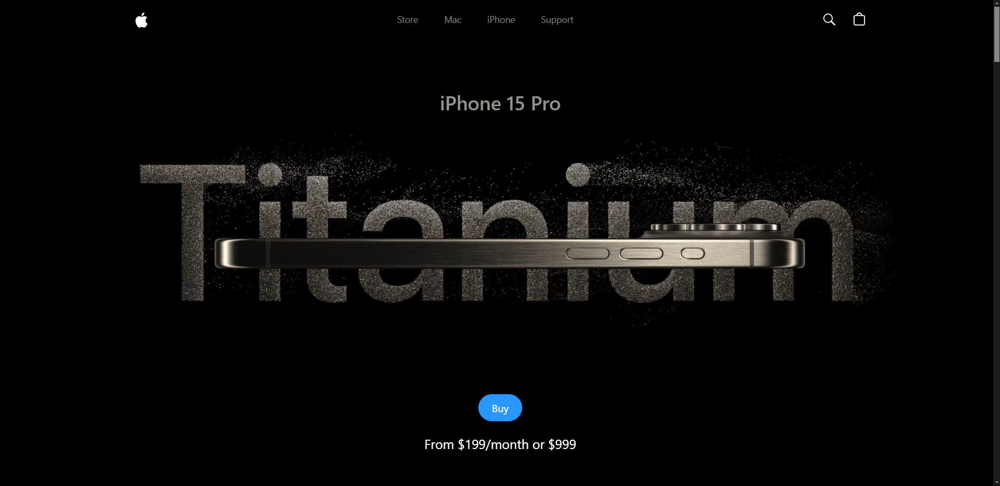
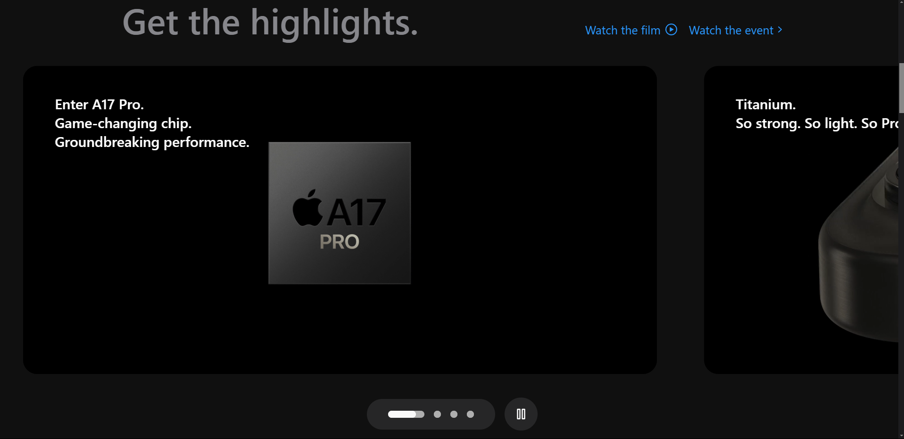
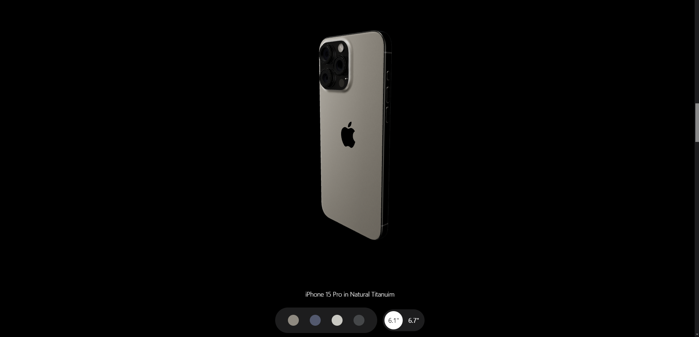

# iPhone 15 Clone Website

Welcome to the iPhone 15 Clone Website! This project is a stunning clone of the official iPhone 15 website, built with modern web technologies to replicate the design and feel of the original.

## Table of Contents

- [Introduction](#introduction)
- [Features](#features)
- [Technologies Used](#technologies-used)
- [Installation](#installation)
- [Usage](#usage)
- [Screenshots](#screenshots)
- [Demo](#demo)

## Introduction

This project recreates the visual appeal and functionality of the official iPhone 15 website. It leverages powerful libraries and frameworks to provide a seamless, interactive user experience.

## Features

- Beautiful Subtle Smooth Animations using GSAP: Enhanced user experience with seamless and captivating animations powered by GSAP.

- 3D Model Rendering with Different Colors and Sizes: Explore the iPhone 15 Pro from every angle with dynamic 3D rendering, offering various color and size options.

- Custom Video Carousel (made with GSAP): Engage users with a unique and interactive video carousel developed using GSAP for a personalized browsing experience.

- Completely Responsive: Consistent access and optimal viewing on any device with a fully responsive design that adapts to different screen sizes.

  and many more, including code architecture and reusability

## Technologies Used

- **React.js** - A JavaScript library for building user interfaces.
- **Three.js** - A library that makes WebGL simpler.
- **React Three Fiber** - A React renderer for Three.js.
- **React Three Drei** - Useful helpers for React Three Fiber.
- **GSAP (Greensock)** - A powerful animation library.
- **Vite** - A build tool that significantly improves the frontend development experience.
- **Tailwind CSS** - A utility-first CSS framework.

## Installation

To run this project locally, follow these steps:

1. **Clone the repository:**

   ```bash
   git clone https://github.com/your-username/iphone15-clone.git
   cd iphone15-clone
   ```

2. **Install dependencies:**

   ```bash
   npm install
   ```

3. **Run the development server:**

   ```bash
   npm run dev
   ```

4. **Build for production:**

   ```bash
   npm run build
   ```

## Usage

After installing the dependencies and running the development server, open [http://localhost:3000](http://localhost:3000) in your browser to view the website.

## Screenshots

Here are some screenshots of the website:


_Home Page showcasing the sleek design._


_Responsive design for mobile devices._


_Product Page with interactive 3D models._

## Demo

Check out the live demo of the website [here](https://apple-website-lac.vercel.app/).
